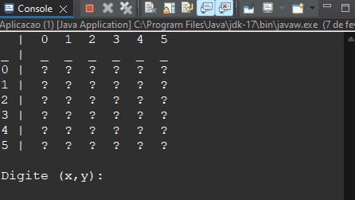

# Campo Minado Java
Bem-vindo ao Projeto de Campo Minado no Console em Java! Este é um jogo simples e divertido que replica o clássico jogo de campo minado, onde o jogador precisa descobrir células sem minas, evitando detonar as minas escondidas. Abaixo vou deixar um exemplo de como o jogo funciona:

Para jogar, basta clonar este repositório e compilar o código-fonte utilizando um compilador Java compatível. Certifique-se de ter o Java Development Kit (JDK) instalado em sua máquina.
### 👨‍💻 Tecnologias

- Java
- JUnit 5

### 😀 Autor

Feito por Jonathan Amarante 👋🏽 Entre em contato!

